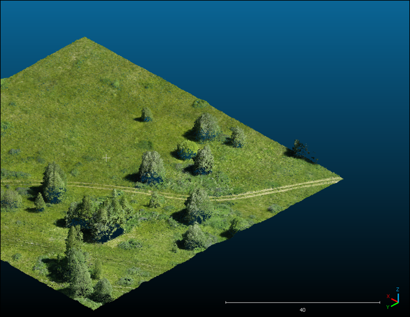
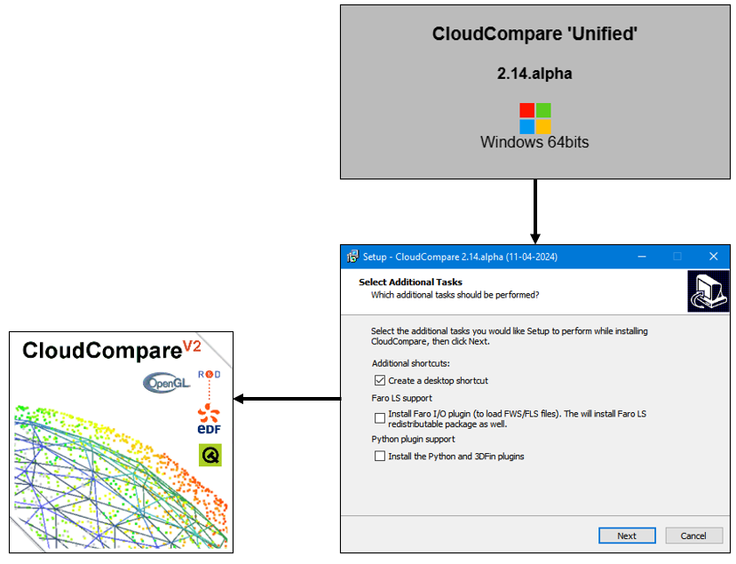
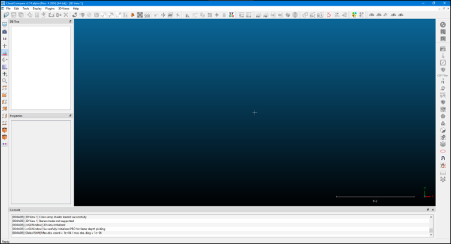
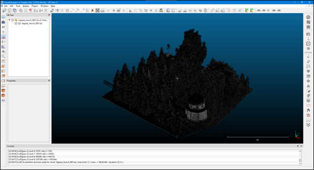

**Introduction to CloudCompare and 3D Point Clouds**

**1. Introduction**

Hello everyone! I'm happy to welcome you to the first lesson of our course about working with CloudCompare and 3D point clouds. My name is Artur Mukhametshin, and I will be one of your teachers for this course. I have experience working with point clouds that I got from processing data from drone flights. CloudCompare has helped me a lot with this work. Because of this, I have good experience using this program.

I suggest that each of you introduce yourself and tell us if you are really interested in this course, or if your boss made you take it.

Great! Now that we know each other a little bit, let's talk about what we will do in the first lesson. Today, we will learn the basic things about working with 3D point clouds, and we will also learn about the tools in the powerful CloudCompare program. By the end of the lesson, you will understand what 3D point clouds are, you will be able to install and start CloudCompare, you will know how to use the program's interface, and you will be able to import and look at point cloud data.

This course will give you useful knowledge and skills that are very needed today. You will be able to work with data from surveying, architecture, cultural heritage, and many other areas. You will be able to create, analyze, and share 3D models. This is a very useful skill that will open many new opportunities for you.

**2. Overview of CloudCompare and its Features**

So, let's start with what CloudCompare is. CloudCompare is a powerful, free, and open-source program that is made for working with 3D point clouds. It is very popular in many fields.

What are the main things you can do with this program? CloudCompare allows us to:

*   Look at and see 3D point clouds.
*   Process and filter data.
*   Do analysis and take measurements.
*   Compare different point clouds.
*   Save results in different formats.

During our course, we will look at each of these features in detail.

Point clouds are used everywhere today. Here are some examples. In construction and architecture, they help to create 3D models of buildings, check the quality of building work, and do surveys. In surveying and mapping, point clouds help to make accurate maps and models of the land. In cultural heritage, they help to make digital copies of historical objects to keep them safe. In industry, 3D point clouds help to check the quality of production and create prototypes.

**3. Basic Concepts of 3D Point Clouds**

Now, let's talk about what a 3D point cloud is. Imagine that you are scanning an object or a scene. The result is a large number of points in three-dimensional space. This is a 3D point cloud. Each point has X, Y, and Z coordinates that describe its position in space. There can also be other things added, like color, reflection, or RGB.

3D point clouds have a structure. Imagine that it's not just a pile of points, but each one has its own position. They can be organized in different ways, like a grid or a tree. The coordinates and other information help us describe the object being scanned and its features.

There are several ways to get 3D point clouds. We can talk about two main groups: active and passive methods. Active methods include LiDAR scanners. They work by sending a laser beam and measuring the time the signal takes to return. This allows us to find the distance to the object. LiDAR scanners are often used in surveying, mapping, and when looking at areas. Structured light scanning is also an active method. In this case, a pattern (like a grid) is projected onto the object, which helps to find the three-dimensional coordinates. Passive methods include photogrammetry. In this case, a 3D model is made from a set of photos. This is a very common method in different fields.

Knowing about 3D point clouds and how to get them will help you work with data more effectively. You will understand where the data comes from, what its special features are, and what problems it might have.

**4. Installing and Setting Up CloudCompare**

Now, let's move on to installing CloudCompare. First, you need to download the program from the official website. Here is the link to the website: https://cloudcompare-org.danielgm.net/release/. I want to say that the program is completely free and does not require a license.

The installation is quite easy, I will guide you through the steps now. Just follow the instructions on the screen. What should you pay attention to? First, during the installation, you will be asked to create a shortcut on the desktop, so you can quickly start the program. Also, if you plan to work with Faro data, put a checkmark next to the Faro plugin. And if you want to use Python, install its plugins too.

For CloudCompare to work well, it's important to have a powerful computer. The program needs a lot of resources, especially when working with large point clouds. I recommend having a strong processor and video card.

After the installation is done, you can start the program. You should see the CloudCompare window, and we can move on to the next part of our lesson.

**5. Overview of the CloudCompare Interface**

Let's now learn about the program's interface. When you start CloudCompare, you will see the main window, where all the work with 3D data happens.

At the top of the window, there is a menu bar. Here you will find all the main commands of the program. Below are toolbars for quick access to the main functions. On the left, you see the DB Tree, which shows all the loaded point clouds. On the right, there is the Properties panel, which shows the properties of the selected object. And at the bottom of the screen, there is the Console, where program messages and errors are shown.

Let's look at the toolbars. Here you will find tools for navigation, showing, and processing 3D data. The Navigation panel allows you to rotate the camera, move around in the scene, and zoom in and out. The Display panel is for setting how the point clouds are shown. And the Tools panel contains different tools for processing and analyzing 3D data. We will learn about each panel in more detail in the next lessons.

In the Properties panel, you can see different details about the selected object, like the number of points, coordinates, and other information. In the Console, you can see messages about the program's actions and errors. This is a very important tool for checking the data processing.

I will give you a few minutes to look at the program's interface yourself, move the mouse around, and see where everything is located.

**6. Basic Navigation and Viewing Tools**

Now let's talk about how to move around and view data in a 3D scene. In CloudCompare, there are several tools for navigation. To pan (move across the scene), you need to press and hold the Shift key and move the mouse cursor on the screen. To rotate, press and hold the left mouse button. To zoom in and out, use the mouse wheel. You can also rotate the camera around a selected object (Orbit); to do this, press and hold Ctrl and the left mouse button. And to center the view on a selected object, press the Auto button.

The program also has tools for better viewing. You can turn the coordinate grid (Grid) and axes (Axis) on or off. You can change the camera settings, such as focal length and viewing angle, and you can change the scene lighting. This helps to analyze the data better.

Don't forget about the shortcut keys. They make it much easier to use the program. For example, the Z key is used for quick zooming, and the cursor keys help you move around the scene.

Try it yourself now, move around the scene, rotate, zoom in and out. See how the image changes when you turn the grid on and off, etc.

**7. Opening and Importing Point Cloud Data**

Now let's learn how to import 3D point clouds into CloudCompare. The program supports many formats, including LAS, PLY, XYZ, PCD, and others. The most common formats are LAS, PLY, and E57.

There are several ways to import data. You can open a file using the File->Open menu, you can use the data manager, or you can just drag and drop a file from the file explorer into the program window.

After importing a point cloud, you can study it. Try moving around the scene, zooming, rotating. Look at the Properties panel, where you can see how many points the cloud contains and what its features are. Look at the DB Tree, how does the structure of the loaded point cloud look.

**8. Practical Exercise**

So, we are moving on to the practical part of our lesson. Now I will give you a sample point cloud. Your task is to:

*   Import the point cloud into CloudCompare.
*   Study the program's interface.
*   Practice navigating the 3D scene.
*   Look at the properties of the imported point cloud.
*   Try out the viewing tools.

**9. Conclusion**

So, we have come to the end of our first lesson. Today we have learned about the powerful tool CloudCompare and the basics of working with 3D point clouds. You learned what a 3D point cloud is, how it is made, and where it is used. You learned how to install and start CloudCompare, how to use its interface, how to move around the scene, and how to import data. You have gained basic skills in using the program that will be useful in your future work.

At home, I ask you to work with the program on your own, try to import other point clouds, and practice navigation and viewing. Also, ask yourself questions: what other formats does the program support, what tools are there for measuring distances.

Your feedback is very important to me. Tell me what you liked in the lesson and what was not clear. This will help me make the next lessons more effective.

Thank you for your participation! See you at the next lesson!
