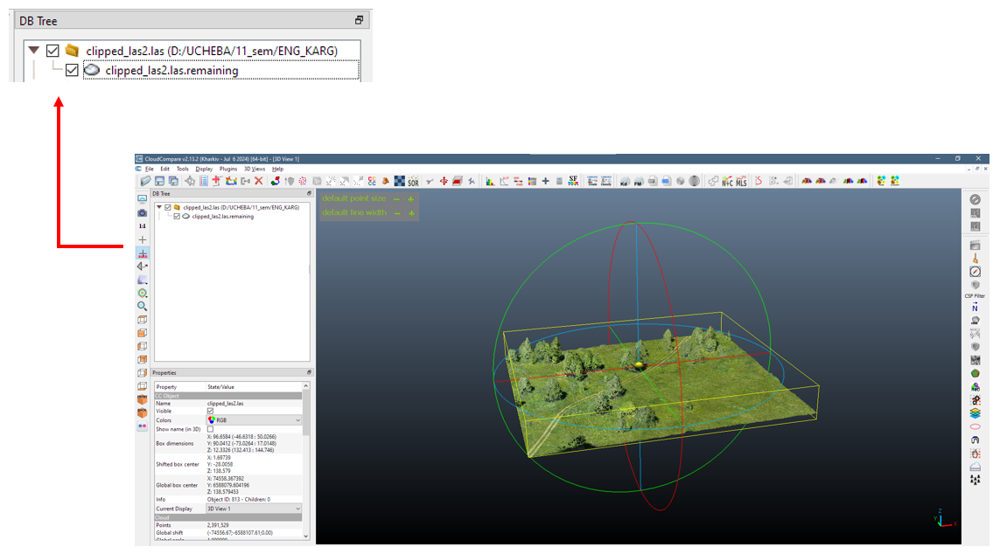
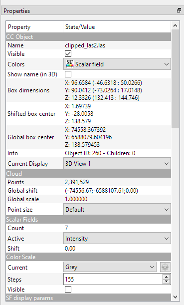
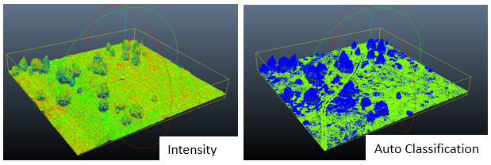
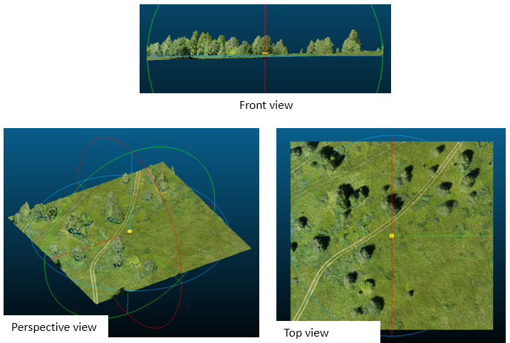
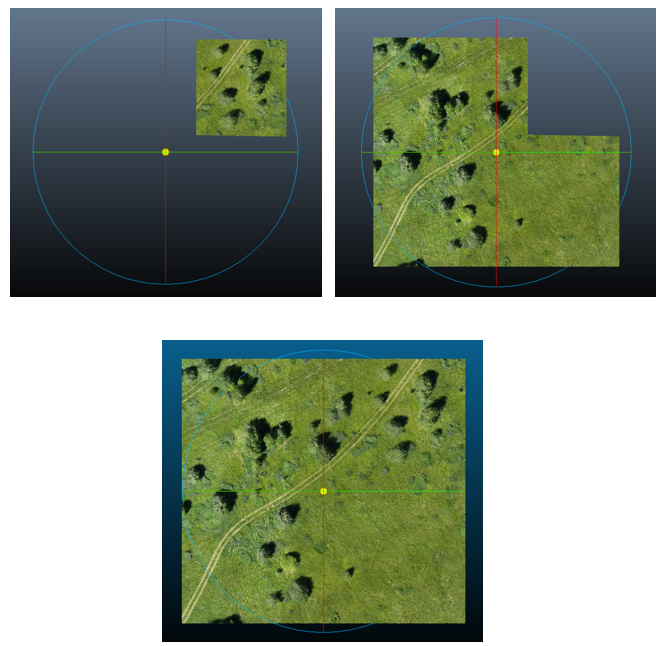
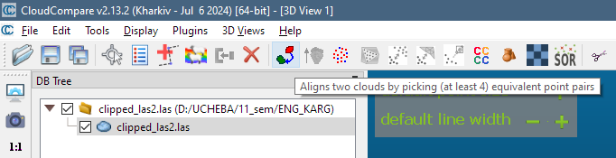
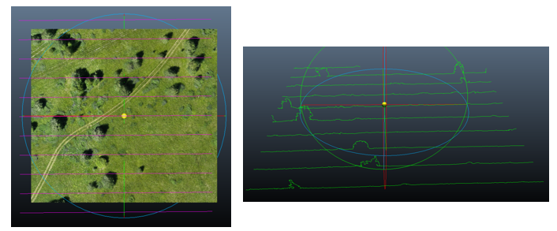
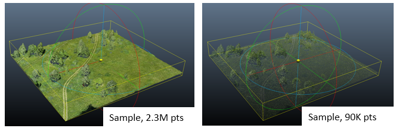
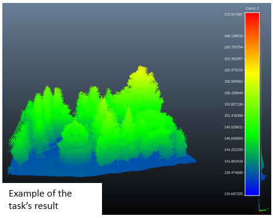

# Basic operations with Point Cloud Data

In this lesson we are going to introduce basic operations with Point Cloud Data which are available in CloudCompare.

## Content
Here is the content of this lesson:
- Review of previous lesson’s results
- Visualizing point clouds
- Basic manipulation of point cloud data
- Practical exercise

## Previous lesson's review
Before this lesson make sure that your point cloud was imported correctly. In this case your CloudCompare interface should be looked like that:

## Visualizing point clouds

In the lower left part you can find an area with point cloud parameters (***"Parameters"***).

Here we will try to set some of them. The most easiest instrument of the visualization is a color. For example, it's setting may improve the ease of perception for Digital Elevation Models. Firstly lets try to choose different color schemas (RGB/Scalar field) and set them to your point cloud.

Besides, there are some of useful small mechanics, which make interaction with point cloud much convenient. It's a group of rotation instruments. They let to change projection and rotation centers, lock rotation for exact axes.

## Basic manipulation
### Segmentation and Aligning
After visualising let's move on to the basic manipulations. Sometimes we don't need the whole cloud of points. To make this easier, it's possible to select some part of the cloud. There are ***Segmentation*** instruments for this task. Drawing polylines in this instrument you can drow cutting lines which will be a boundary of extracted cloud's part. Also we can export drawn lines for future work. Separated segments may be cloned or aligned.

### Profiles and sections
Values of point's parameters may be extracted by specified profile lines. For example it may be needed for building height profiles. Such profiles may be drawn by user or created regularly. Heights in profiles may be exported in vector-format data with line and point geometry types. Also profile lines may be used for slicing point cloud by sections.

### Subsampling
Sometimes point clouds (just like other datasets) may be too detalized and complex for processing. Subsampling lets recalculate datasets and increase or decrease their resolution (and their volume as a consequence). CloudCompare supplies different methods of subsampling. Also it's possible to assess point density of the cloud. It helps to make quantific assessment of point cloud changing.

## Practical Exercise. Performing basic operations
**Objective:** users must carry out basic operations with point cloud that were mentioned in this class. Also they will face with the sample of big-volume data and ways of optimizing workflow with them.

**Materials:**
- Sample Point Clouds. Download 2 sample point clouds from Google Drive.

**Tasks:**
1. **Cutting a Segment.** Clip a random part of the sample point cloud 1.

2. **Building Profiles.** Build stack of profiles with 10m-step for sample point cloud 1. Export 2 datasets with points and lines of profiles, visualize them in any other GIS software to make sure they are correct.

3. **Subsampling the Point Cloud.** Import sample point cloud 2. Reduce number of points in the sample cloud 2 to optimize further workflow.

4. **Explore Coloring Possibilities.** Try to apply different types of colors to the sample point cloud 2 (Intensity, Coord.Z, …). Try to find out what they mean. Make the final visualization with coloring by height field. Add color scale to the viewport.

