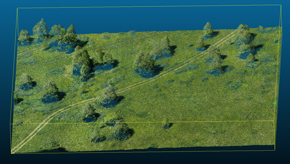
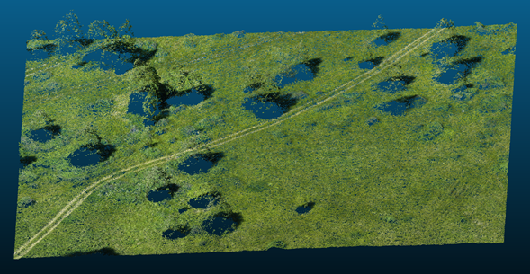
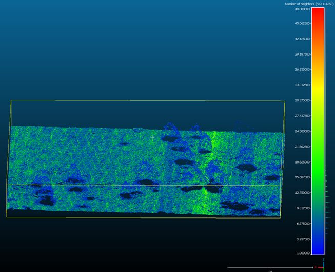
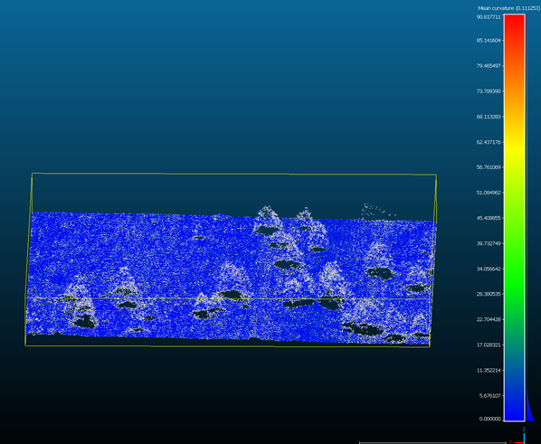

# Lesson 3: Filtering and Analysis Techniques

## Objectives
- Introduce methods for filtering and analyzing point cloud data in **CloudCompare**.
- Demonstrate how to apply filters to clean and optimize datasets.
- Explore analysis tools to extract meaningful information from point clouds.

## Point Cloud Filtering

### Why Filtering is Necessary?
- **Noise Reduction**
- **Data Volume Optimization**

### Types of Filters:
1. **Noise Filter**  
2. **Statistical Outlier Removal (SOR)**  
3. **Scalar Field Filters** (e.g., Bilateral, Gaussian)

### Filter Comparison:
- Without Filter

- With SOR Filter 

## Point Cloud Analysis

### Density Analysis
- Use **Calculate Geometries Features** to compute the point density of a cloud.
- Identify sparse and dense regions to assess data distribution.
  - Metrics: Number of neighbors, surface density, volume density.

**Density**

### Curvature and Roughness Analysis
- **Curvature Analysis**: Highlights areas with significant changes in surface slope.
- **Roughness Analysis**: Measures surface irregularities, useful for terrain analysis or object characterization.

**Curvature**

### Distance Analysis
1. **Cloud-to-Cloud Distance**: Compare two point clouds to detect changes or misalignments.  
   _Applications: Monitoring deformation, progress tracking in construction._
2. **Cloud-to-Mesh Distance**: Calculate distances between a point cloud and a mesh to assess model accuracy or detect deviations.
3. **Cloud-to-Primitive Distance**: Calculate distances between a point cloud and a primitive shape.

## Practical Exercise

### Objective
- Apply filtering and analysis techniques to a real-world dataset.

### Tasks
1. **Import a Point Cloud**: Load a [sample dataset](https://disk.yandex.ru/d/u_nFt4shIi6Biw) into **CloudCompare**.
2. **Apply Filters**: Test different filters and observe their impact on data quality.
3. **Perform Analysis**: Analyze density, curvature, and roughness.
4. **Compute Distances**: Measure distances between a point cloud and a custom primitive.
5. **Compare Results**: Visualize and document differences before and after filtering.

### Discussion
- Review results from the practical exercise.
- What worked well?
- Which filters and analysis methods were most effective?

---

## Homework Assignment

### Task
- Apply the learned techniques to your own dataset (e.g., aerial laser scanning of terrain in different years).
- Draw conclusions about terrain changes.

### Deliverable
Prepare a short report documenting:
1. **Filtering Methods Used**
2. **Analysis Results** (including visualizations and observations)
3. **Recommendations** for improving data quality and insights gained.
4. **Conclusion** about terrain changes.