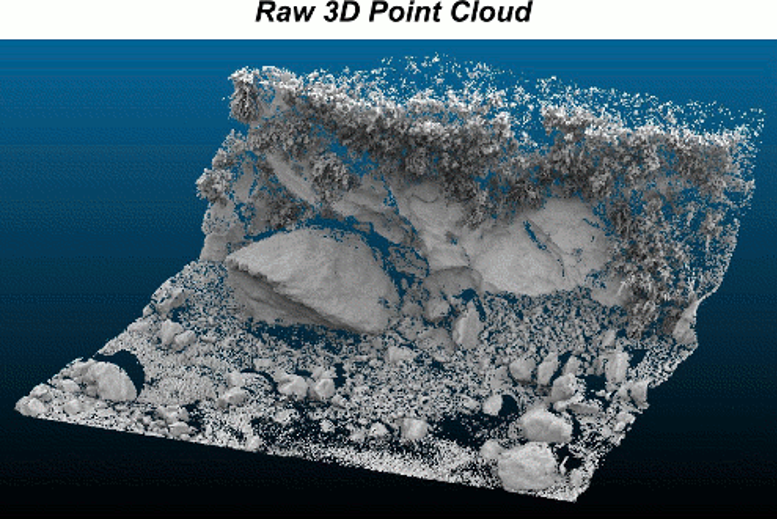
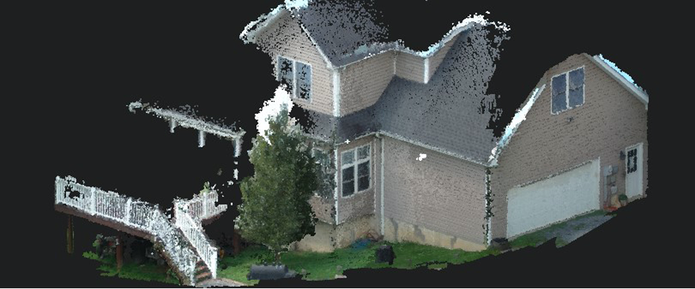
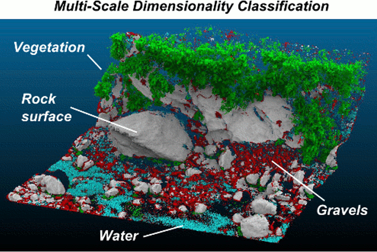
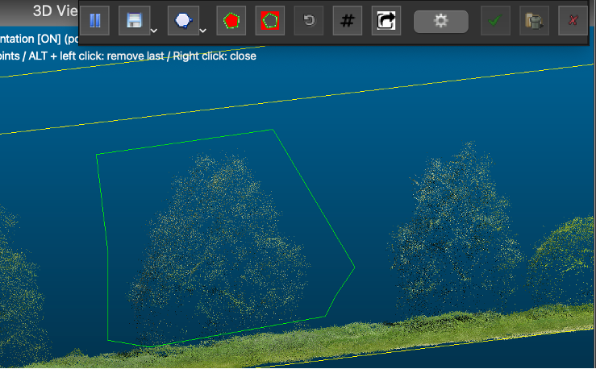
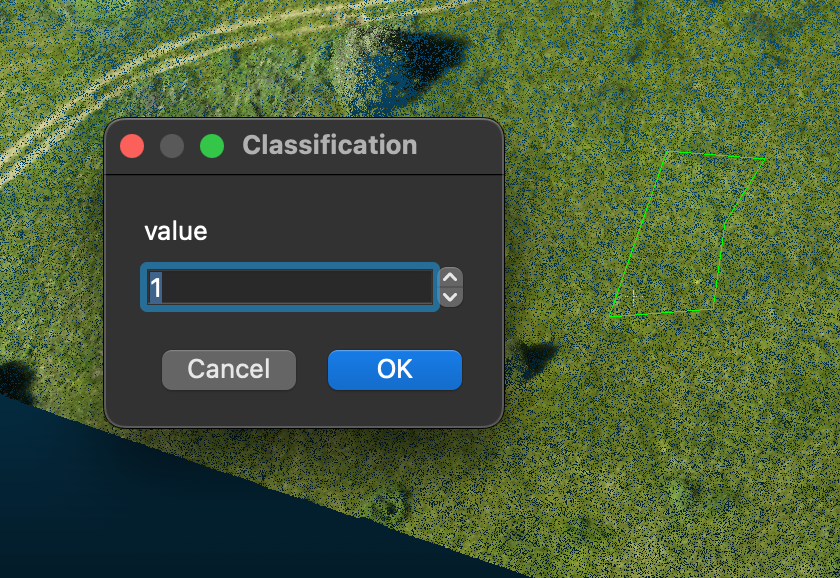
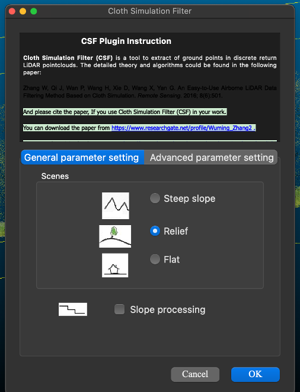
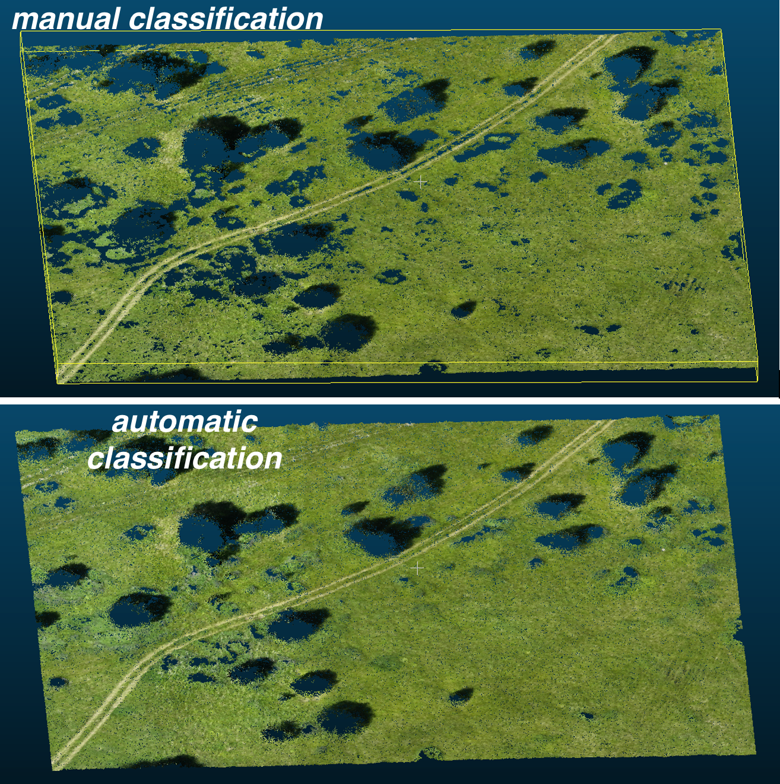
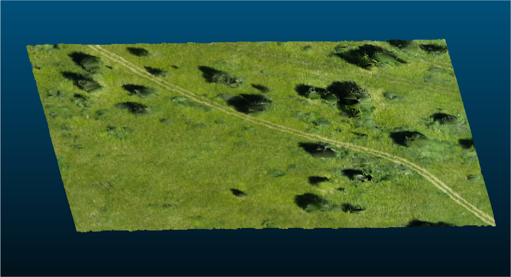
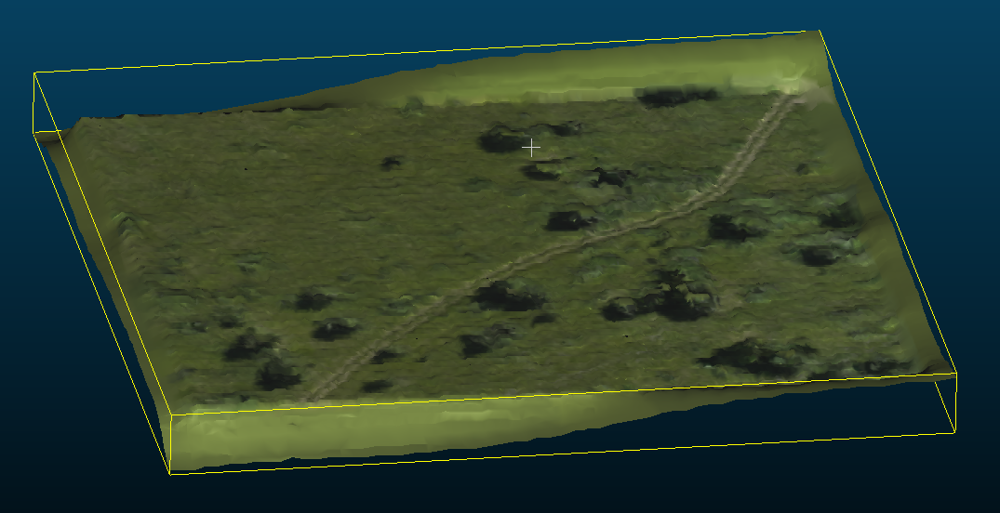

# Point Classification and Mesh Creation in CloudCompare

## I. Theoretical Part

### What is a Point Cloud?
A point cloud is a set of 3D coordinates (X, Y, Z) that describe the shape of an object or scene. These coordinates are a simple representation of the real world.

There are several ways to get point clouds:

*   **Laser Scanning (LiDAR):** This technology uses a laser to measure distances. The scanner sends out light pulses that reflect off surfaces and return to the sensor. By measuring the time it takes for the light to travel, the scanner finds the distance to each point. This creates a precise 3D view of the object. LiDAR can be used on planes, drones, cars, or by hand.
*   **Photogrammetry:** This method uses many overlapping photos of the same object. Software analyses the photos and finds the 3D coordinates of points that are visible in several photos. This makes a point cloud for creating 3D models.

Point clouds are a powerful way to capture and show the real world in a digital way. But to use this data well, we often need to process it.

For example, think about a point cloud that shows a city. It might have points for buildings, roads, trees, and cars. To analyze this data, we often need to choose certain things, like buildings or roads. This is why we use point cloud classification.

Classification is the process of dividing points into groups, or classes, based on their features. This can be height, color, reflection, shape, or other information. For example, points that show the ground can be in one class, and points that show buildings can be in another.

Classification helps us choose the objects we want, make analysis easier, create more accurate models, and make more realistic 3D views. For example, to estimate the amount of wood in a forest or look at the condition of roads, we first need to classify the data.

We can use CloudCompare to process point clouds. It is a free tool that lets us see and work with point clouds. It can also do classification, filtering, alignment, mesh creation, and other things.

In this lesson, we will look at the main CloudCompare tools for classifying point clouds and creating 3D meshes. Let's start our journey into the world of 3D data!

### Point Cloud Classification
Now, let's learn more about classification. It's a very important step in working with point clouds.
Classification is about giving each point in the cloud a label or class. These labels tell us what type of object or element each point belongs to. In a city point cloud, we can have these classes:

*   **Ground/Terrain:** Points for the ground, roads, and sidewalks.
*   **Vegetation:** Points for trees, bushes, and grass.
*   **Buildings:** Points for buildings, walls, and other structures.
*   **Roads:** Points for the road surface and other road parts.
*   **Water Bodies:** Points for lakes, rivers, and ponds.
*   **Other:** Other classes, such as power lines, cars, and fences, depending on what we need.

**Why do we need classification?**

Classification is needed for several reasons:

1.  **Easier Analysis:** It lets us select the objects we want and ignore other data, which makes analysis simpler.
2.  **Better Modeling:** It helps make more accurate 3D models, especially for architecture.
3.  **Automation:** We can use classified data to automate tasks, such as tracking changes in forests or creating land use maps.
4.  **Basis for Other Operations:** It is often the first step for other processing tasks, such as filtering, alignment, and mesh creation.
5.  **Visualization:** Classified data makes information clearer by using different colors for each class.

**Classification Methods**

There are two main ways to classify point clouds:

*   **Manual Classification:** We select points and give them classes ourselves. This is needed for complex objects or for making perfect data.
*   **Automatic Classification:** This uses software to automatically find classes based on the points' properties. It is faster, but it may not be as accurate as manual classification.

In our lesson, we will learn both methods in CloudCompare.

### CloudCompare Classification Tools
Now, let's look at the tools in CloudCompare. The program offers both manual and automatic classification tools for working with point clouds.

**Manual Classification in CloudCompare**
Manual classification is when you decide the class of each point or group of points. This is helpful when automatic methods are not good enough or when you need high accuracy. Here are the main tools:

*   **"Segment" Tool:** This tool lets you select groups of points using rectangles, circles, or polygons. Selecting segments is important for manual classification. After selecting, points are assigned a class.

*   **"Edit > Scalar Fields > Set Value" Tool:** This tool is for giving selected points a value. For classification, the value corresponds to a class. For example, if you select points for trees, you can set their value to "Vegetation."

*   **Manual Classification Process:** Manual classification involves looking at the CloudCompare window, finding the right characteristics, selecting segments, and assigning classes using the “Set Value” tool.

**Automatic Classification in CloudCompare**
CloudCompare also supports automatic classification using plugins. Plugins are add-ons that increase what the program can do. Let’s consider one popular automatic classification plugin:

*   **CSF (Cloth Simulation Filter) Plugin:** This uses a cloth simulation method to find points representing the ground. The plugin "puts" a cloth on the point cloud. Points under the cloth are considered ground points. Points above the cloth are considered objects like plants and buildings.
    *   **How it works:** CSF uses physics simulation. The plugin imitates how gravity would affect a cloth over the point cloud. Points holding up the cloth are ground points.
    *   **Main Settings:** The plugin has adjustable settings like cloth size and stiffness, which change the results.
    *   **Application:** CSF is used a lot to separate ground points from vegetation and buildings.

**Choosing a Classification Method**

The choice between manual and automatic classification depends on:

*   **Amount of Data:** For small point clouds, manual is fine. For large ones, automatic is better.
*   **Needed Accuracy:** Manual is more accurate, but takes more time. Automatic can be faster, but may need more adjustments.
*   **Time Limits:** If time is short, automatic is better, even if the accuracy is slightly less.

In the practical part, we will learn both methods and see their benefits and drawbacks.

So, we have reviewed the main classification tools in CloudCompare. Now, let's move on to filtering point clouds for more flexibility and accuracy.

### Filtering Point Clouds

Why do we need filtering?
Imagine that after classification, there is still "noise" in your point cloud. This could be points that are not part of what you're interested in, or points that were classified wrong. Filtering helps us get rid of this noise and only keep the data we want. Here are some main reasons why filtering is important:

1.  **Remove Noise and Unwanted Data:** Filtering helps remove points that are not needed or that can affect the analysis.
2.  **Choose Interesting Parts:** We can filter to select points of a certain class, a height range, or other things.
3.  **Prepare Data for Modeling:** Before creating 3D models, we often need to filter data to get cleaner and more accurate geometry.
4.  **Simplify Visualization:** By removing unwanted points, we can improve how the point cloud looks and make it easier to understand.

**"Filter by Value" Tool in CloudCompare**

CloudCompare has many tools for filtering point clouds. One useful tool is "Filter by value". It allows you to filter points based on the values of a scalar field.

*   **How it works:** You select a scalar field (e.g., a field with class information) and set a range of values you want to keep. Points with values in that range are kept in the new filtered point cloud, and the others are removed.
    *   **Example:** If you want only the "ground" points, you choose the classification scalar field and set a range that matches the "ground" class.
    *   **Creating a New Point Cloud:** "Filter by value" doesn't change the original point cloud. It makes a new one with the filtered data.

**Using the "Filter by Value" Tool**

This tool can be used for different purposes:

*   **Choosing Classes:** You can use "Filter by value" to select points of a specific class, like just buildings or just vegetation.
*   **Filtering by Height:** If you have height data, you can filter to select points in a certain height range, such as removing points of tree crowns to only keep the ground.
*   **Filtering by Intensity:** If your point cloud has reflection intensity data, you can filter to select points with a certain intensity.

**Other Filtering Methods (Overview)**

Besides "Filter by value", CloudCompare has other filtering methods:

*   **Distance-Based Filtering:** Remove points that are at a certain distance from other points, such as removing single noisy points.
*   **Intensity-Based Filtering:** As already mentioned, useful if there is information about the intensity of the reflected laser signal.

In conclusion, filtering is a great tool to clean and process our point clouds for better analysis. In our practice exercise, we'll see how to use "Filter by value" to choose the data we want.

### Creating 3D Meshes
So, we've learned how to classify and filter point clouds. Now it’s time to turn our data into 3D models. For this, we’ll create a 3D mesh.
What is a Mesh?
A mesh is a way to show a 3D surface using polygons, usually triangles. Imagine you connect all the points on the surface with many small triangles. This makes a mesh model that can be used for seeing the model, 3D printing, analysis, and other things.

Why do we need meshes?

Point clouds are good for showing data, but not always convenient for all tasks. Meshes, on the other hand, offer a more structured way to represent 3D geometry. Here are a few reasons why we create meshes:
1. Visualization: Meshes show 3D objects more clearly than point clouds. They let us see smooth surfaces, not just points.
2. 3D Modeling: Meshes are the basis for creating 3D models, used in games, architecture, and more.
3. Surface Analysis: Meshes let us measure areas, volumes, curvature, and other surface properties.
4. 3D Printing: Meshes are a format used for 3D printing, which lets us make real objects from digital models.

Main Mesh Creation Algorithms in CloudCompare
CloudCompare has several algorithms for making meshes from point clouds. We’ll look at two main ones:
1. Delaunay Triangulation: This is a simple algorithm that connects points into triangles so that no points are inside the circles around any triangle.
     * How it works: Delaunay builds triangles to best fill the space between points.
     * Features: It is quick and good for simple shapes, but can create “rough” edges and is not good for complex surfaces. It is also very sensitive to noise.

2. Poisson Reconstruction: This uses the Poisson equation to make a smooth surface from a point cloud.
     * How it works: Poisson tries to fill the gaps between points to create a smooth surface.
     * Features: It is more accurate and creates smoother surfaces than Delaunay. It is less sensitive to noise, but needs adjusted parameters like depth and the amount of points for analysis. The algorithm needs more computing power.

Comparing Algorithms

The choice of algorithm depends on the task and type of data. Here’s a quick comparison:

| Feature | Delaunay Triangulation | Poisson Reconstruction |
| ----------- | ----------- | ----------- |
| Speed | Fast | Slower |
| Quality | Can be rough | Smooth surface |
| Complexity | Good for simple shapes | Good for complex shapes |
| Sensitivity to noise | High | Less sensitive |
| Parameter adjustment | Not required | Required |

For our exercise, we’ll use Poisson Reconstruction, as it creates better, more accurate models, especially for complex shapes.

Now you have an understanding of what meshes are and how to create them in CloudCompare. This finishes the theoretical part of our lesson.

## II. Practical Part

### Practice Exercise: Classification and Mesh Creation in CloudCompare

**Goal:** To classify a point cloud and create a 3D mesh using CloudCompare tools.

**Materials:**

*   Example point cloud (format .las, .ply, or other supported by CloudCompare)
*   Installed CloudCompare software

**Tasks:**

1.  **Preparation:**
    *   Load the given point cloud into CloudCompare.
    *   Check the program interface: view window, toolbars, tabs.
2.  **Point Classification:**
    *   **Manual Classification:**
        *   Use the "Segment" tool to select groups of points that represent the ground, buildings, and vegetation.
        *   Assign classes to the selected points using "Edit > Scalar Fields > Set Value". Use values like:
            *   1 - Ground
            *   2 - Vegetation
            *   3 - Buildings
        * Try to create at least 3 classes in your point cloud.
   *   **Automatic Classification:**
        *   Install and start the CSF plugin (if it is not installed, follow instructions for installing CloudCompare plugins).
        *  Use CSF to classify the point cloud automatically.
        *   Compare results of manual and automatic classification. Judge their accuracy.
3.  **Filtering Data:**
    *   Use "Filter by value" to select points of a specific class (e.g., only ground points).
    *   Make a new point cloud with the filtered data.
4.  **Creating a Mesh:**
    *   Choose a point cloud you want to use for making a mesh (it's better to use the filtered ground points).
    *   Start Poisson Reconstruction ("Tools > Mesh > Poisson Reconstruction").
    *   Experiment with the "Depth" parameter. Observe how this parameter affects the result.
    *   Assess the mesh quality.
5.  **Analysis and Export:**
    *   See the classified point cloud and mesh in the viewing window.
    *  Add a color scale ("Edit > Scalar fields > Add color scale") to emphasize height differences in the mesh (if you have a height scalar field).
    *   Export the classified point cloud and mesh to separate files (e.g., .las, .ply, .obj).

**Recommendations:**

*   Start with manual classification to better understand the data.
*   Take your time setting the parameters of CSF and Poisson Reconstruction.
*   Pay attention to changes in the view window when changing parameters.
*   Experiment with different settings to learn how they affect the result.
*   If you have questions, feel free to ask.

**Expected Result:**

*   You should have a classified point cloud with at least three classes (ground, vegetation, buildings) and a 3D mesh based on the filtered point cloud.
*   You should know how to adjust CloudCompare settings for the best results.
*   You should know how to analyze and export the results.