# Practical applications of CloudCompare

## Theoretical part

This is the final lesson of our course. In this lesson, we will explain who the main users of CloudCompare are, provide examples of using CloudCompare in real scientific research, and show you how to segment trees using CloudCompare tools.

### Who are the main users of CloudCompare?

CloudCompare has become a go-to tool for professionals and researchers working with 3D point cloud and mesh data. Its user base spans a variety of disciplines, including:

*   **Geospatial Analysts and Surveyors**: These professionals use CloudCompare to process LiDAR data, generate digital elevation models, and analyze terrain features;
*   **Architects, constructors and civil engineers**: These specialists rely on CloudCompare to evaluate building models, assess construction progress, and perform defect detection in infrastructure;
*   **Archaeologists**: Archaeologists employ CloudCompare to create 3D models of excavation sites and analyze structural changes over time;
*   **Scientists (geologist, geographers, ecologists)**: Many university-level researchers incorporate CloudCompare into their studies across geology, biology, and forestry due to its robust analytical tools;
*   Anyone else, who works with point clouds and meshes.

### Examples of real use of CloudCompare

In this part of the lesson, you will learn how CloudCompare is used in scientific research. We will explore three studies from different fields of science where researchers have utilized CloudCompare.

#### **CloudCompare in archaelogy**

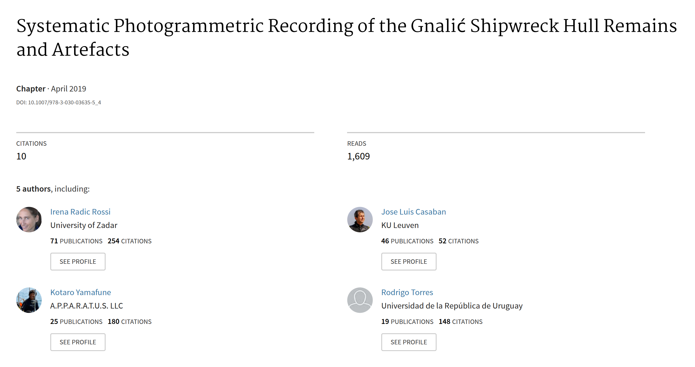

The article titled "Systematic Photogrammetric Recording of the Gnalić Shipwreck Hull Remains and Artefacts" discusses the application of photogrammetry in documenting the Gnalić shipwreck, located near the islet of Gnalić in Northern Dalmatia, Croatia. Discovered in September 1967, the shipwreck garnered significant interest but faced excavation challenges due to logistical and financial constraints, leading to only five short-term rescue research campaigns totaling 54 working days. After a 45-year hiatus, the project resumed in 2012 with a trial campaign, followed by systematic annual excavations.

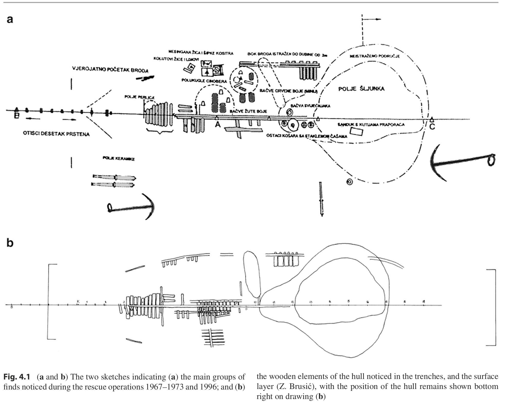

Given the site's complexity and time constraints, photogrammetry emerged as an efficient and effective tool for recording the excavated areas, including the cargo, equipment, and hull remains. The article highlights how advancements in photogrammetry have transformed it from a specialized skill into a broadly accessible tool, facilitating detailed underwater archaeological documentation. The authors share their experiences in utilizing photogrammetry throughout the ongoing excavation, emphasizing its benefits and limitations in capturing the site's intricate details.

This approach has enabled the creation of accurate 3D models of the shipwreck, aiding in analysis and preservation efforts.

In this article scientists used points based deviation analysis in CloudCompare. The dense points cloud data of the area, which contained large barrels and smaller casks, were exported into CloudCompare and the deviation analysis was applied. The software displayed ‘excavated areas’ in colour and provided differences in quantitative data (for instances, how much additional surface had been excavated). Based on the results, it is suggested that stratigraphic recording and analysis could be aided by application of ‘deviation analysis‛. Additionally, this application could be used for multi-year site monitoring; in other words, the ‘deviation analysis’ based on photogrammetry could track changes on underwater sites over time, and could be used for site management plans.

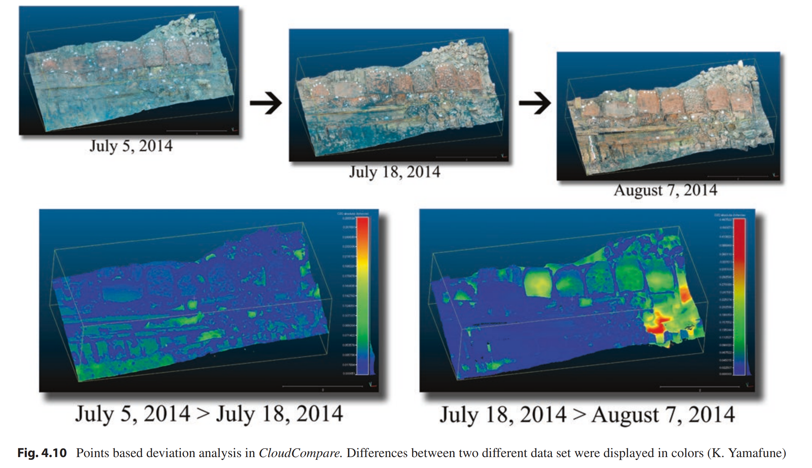

#### **CloudCompare for civil enginnering**

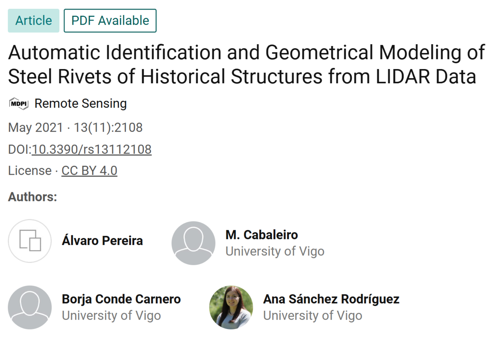

The article "Automatic Identification and Geometrical Modeling of Steel Rivets of Historical Structures from Lidar Data" presents a novel methodology for the automatic identification and 3D modeling of rivets in iron and steel structures using Lidar data. This approach addresses the labor-intensive and error-prone process of manually measuring and modeling thousands of rivets typically found in such structures. The methodology was tested on both laboratory specimens and a full-scale real bridge.

Riveting was a prevalent joining technique in iron and steel constructions from the mid-19th to early 20th centuries. Many of these riveted structures remain in use today and are considered significant cultural heritage. Maintaining and conserving such structures is essential, and Historic Building Information Modeling (HBIM) has emerged as a valuable tool for monitoring and preservation efforts. In this context, accurately modeling rivets is crucial for assessing structural safety and health over time. Given that these structures can contain thousands of rivets, manual measurement and modeling are labor-intensive and prone to errors.

To address this challenge, the authors developed a methodology that automates the identification and 3D modeling of rivets from Lidar data. They tested their approach on both laboratory specimens and a full-scale real bridge, demonstrating its effectiveness in accurately detecting and modeling rivets. This advancement has significant implications for the efficient maintenance and conservation of historical iron and steel structures, enhancing the precision and reliability of HBIM processes.

The researchers used CloudCompare for the processing of the point cloud. Firstly, a region of interest (ROI) that contains the surface of the joint where the position of the rivets is to be detected was selected. Then to avoid problems with possible outliers due to noise, a Statistical Outlier Removal (SOR) filter to remove outliers of the ROI point cloud was applied.

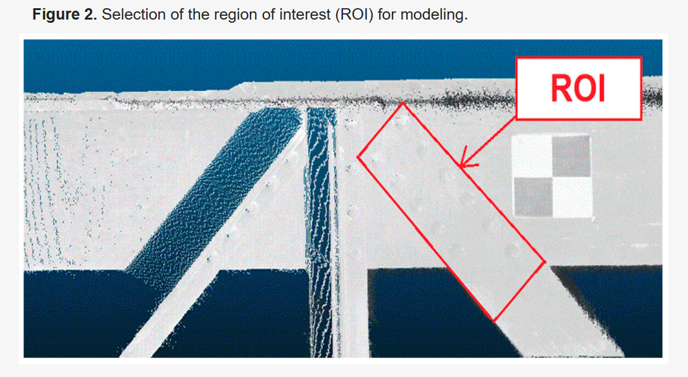

The main part of geometrical modelling was provided using SolidWorks, but the authors used CloudCompare for comparing 3D solid model of the bridge with the scanned point cloud using the inbuilt capabilities of CC software. Once the point cloud is overlapped on the 3D model of the riveted joint, the distances between them are calculated by means of the “Compute cloud/mesh distance” function of CloudCompare, obtaining the results shown in figure below and quantified in the histogram. This histogram shows the deviation for each zone of the point cloud in the form of a color code (clusters). The rivet heads (displayed in blue) show a negative deviation; that is, the model protrudes above the point cloud. This effect is because the rivets have been modeled as regular hemispheres (mainly for the sake of simplifying the modeling process) while the real ones have a flatter head due to the riveting process (see figure below).

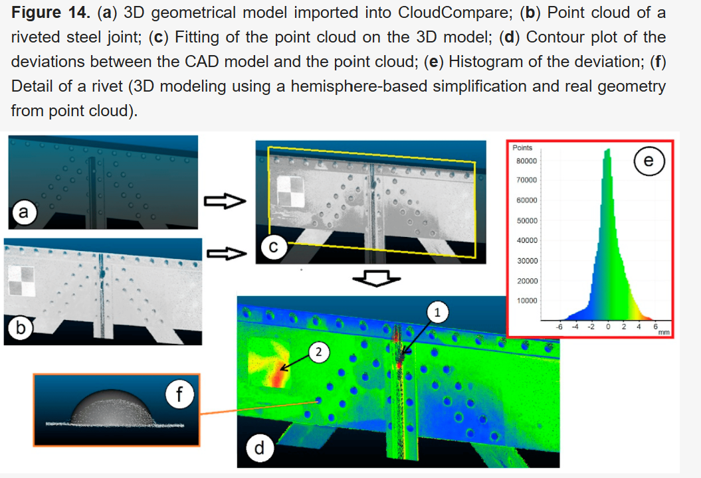

#### **CloudCompare for architecture**
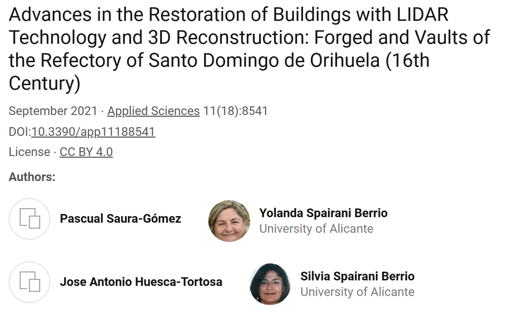
The article "Advances in the Restoration of Buildings with LIDAR Technology and 3D Reconstruction: Forged and Vaults of the Refectory of Santo Domingo de Orihuela (16th Century)" presents a comprehensive study on the restoration of the Refectory of Santo Domingo in Orihuela, Spain, utilizing modern technologies such as Terrestrial Laser Scanning (TLS) and photogrammetry.

The authors detail the restoration process aimed at achieving structural stability and restoring both the refectory area on the ground floor and the upper space on the first floor for use as teaching workshops. The restoration involved several key steps, including the protection of unique elements like 18th-century tile plinths and mural paintings, stabilization and consolidation of walls, reinforcement of vaults and arches, and the installation of new horizontal frameworks.

A significant aspect of the study is the application of TLS and photogrammetry techniques to monitor and document the restoration process. These technologies allowed for precise data collection on the geometric positions of architectural elements, facilitating detailed analysis and comparison of the building's state before, during, and after restoration. The integration of these techniques provided valuable insights into the structural behavior of the building under different load conditions and contributed to the development of effective restoration strategies.

The study emphasizes the importance of combining historical analysis with modern technology to preserve architectural heritage. The use of TLS and photogrammetry not only enhanced the accuracy of the restoration work but also ensured thorough documentation for future maintenance and research. The authors conclude that such an integrated approach is essential for the successful restoration and preservation of historical structures.

Cloudcompare software was used to analyse the data from the different states of the work, taking certain characteristic points as a reference, and carrying out verification tests so that the distances between them were constant in the stages compared.

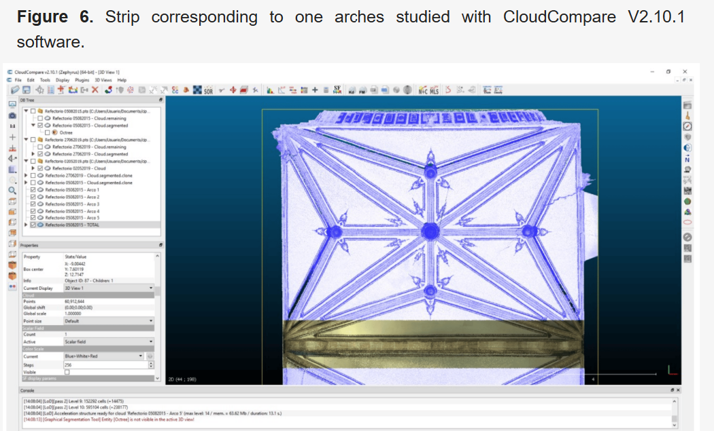

The coordinates (height) of each of the points observed in the comparison of the 5 arches analysed before (2015) and after (2019) the works are shown below.

Having established the position of a certain point (always the same) in each of the keys clearly referenced to another point fixed in the space of the refectory and without any possibility of movement, in order to take the measurements that register the possible differential movements in three-dimensional coordinates of one stage with respect to the other.

CloudCompare enabled the authors to document and visualize changes between different restoration stages. By overlaying point clouds captured at different times, they could identify areas where significant structural or material changes had occurred.

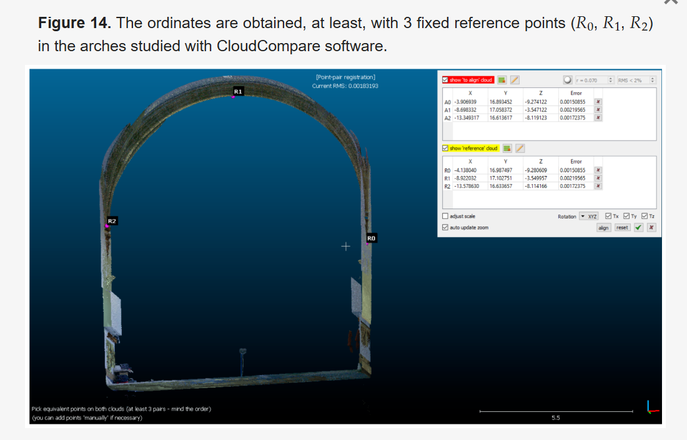

### Introduction to tree detection using CloucCompare 

Tree detection and segmentation are common tasks in forestry, environmetal sciences, urban planning for analyzing spatial distribution of trees, tree metrics such as height, crown dimensions, etc.

The TreeIso plugin in CloudCompare is specifically designed for the segmentation and analysis of trees within a 3D point cloud. The plugin leverages algorithms to isolate and identify individual trees or tree components, such as trunks and crowns, from dense point clouds.

There are 5 key features of the TreeIso plugin:
* **Tree segmentation**: The plugin identifies and separates individual trees in a point cloud dataset, even in dense forest areas. It segments tree trunks, branches, and crowns into distinct clusters.
* **Crown delineation**: TreeIso helps delineate the crown of each tree by clustering points based on their height and spatial distribution. This is essential for estimating canopy dimensions and analyzing forest structure.
* **Trunk detection**: The plugin can identify tree trunks, which are critical for volume estimation and biomass calculations. Trunk detection is based on the cylindrical shape of the tree stems and their vertical alignment.
* **Cluster-based processing**: The plugin uses advanced clustering techniques to group points into individual tree components. These clusters can be visualized or exported for further analysis.
* **Parameter customization**:  Users can fine-tune segmentation parameters, such as clustering thresholds, tree height ranges, and ground-filtering options. These parameters allow for handling varying tree densities and point cloud qualities.

The main advantages of TreeIso plugin are:
* Efficient handling of dense point clouds.
* High accuracy in segmenting individual trees and their components.
* Customizable parameters for diverse forest types and tree densities.

On the other hand, there are some limitations of the plugin:
* Performance may decrease with very large point clouds or complex forest structures.
* Dense overlapping crowns in natural forests can pose challenges for segmentation accuracy.
* Requires high-quality point clouds (e.g., LiDAR) for best results.

The TreeIso plugin was developed in 2023, based on the article Xi, Z.; Hopkinson, C. 3D Graph-Based Individual-Tree Isolation (Treeiso) from Terrestrial Laser Scanning Point Clouds. Remote Sens. 2022, 14, 6116. https://doi.org/10.3390/rs14236116.
Here you could see the workflow of TreeIso algorithm.
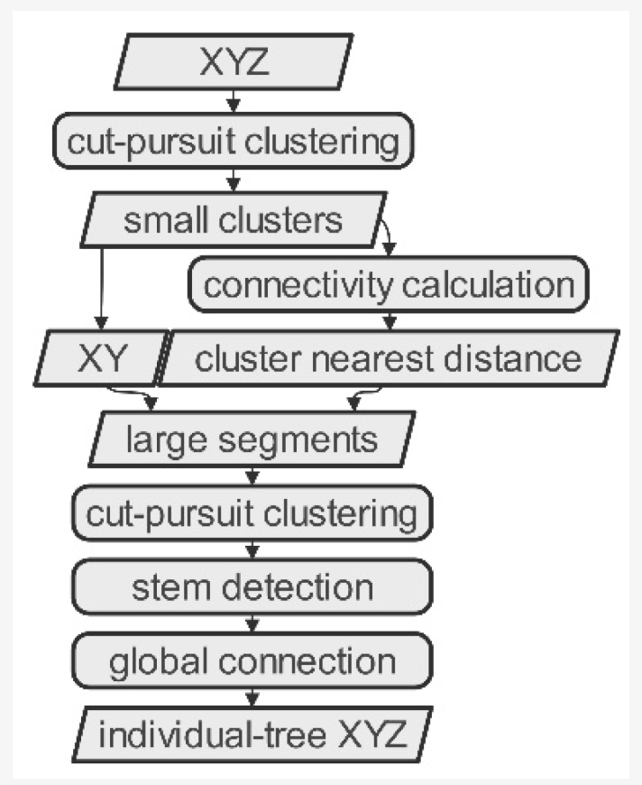

For more detailed information about the plugin, please, read the article!

## Practical exercise

This is the final exercise of our course. You will need to demonstrate the knowledge you have gained in previous lessons to preprocess a point cloud, and then, using the TreeIso plugin, segment the point cloud into individual trees and export them in the .las format.

**Goal:** To segment the point cloud into individual trees and export the indidual tree point clouds.

**Materials:**

*   Example point cloud (park_church.las) of part of the park. https://disk.yandex.ru/d/SnHMd7IsZiK7HQ
*   Installed CloudCompare software v.2.13 or newer.

**Tasks:**

1.  **Preparation:**
    *   Load the given point cloud into CloudCompare.
    *   Filter the point cloud using Statistical Outlier Removal.
    *   Extract ground points using Cloth Simulation Filter.
    *   Clip any part of cloud with ~10-15 trees using Segment tool.
2.  **Tree Segmentation:**
    *   Select the clipped point cloud and launch the TreeIso plugin.

    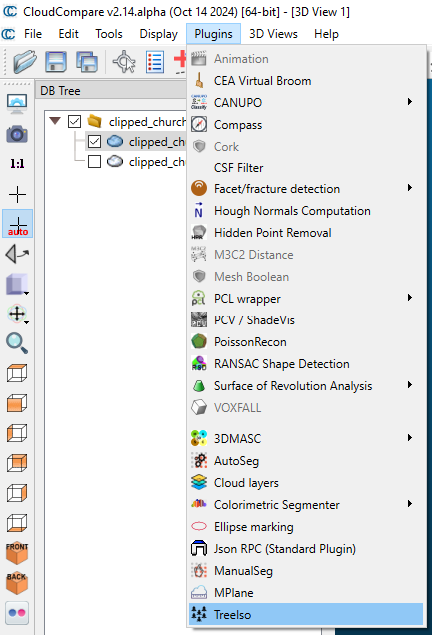

    *   Put in paramaters and do the initial segmentation - 3D Cut-pursuit algorithm.
    
    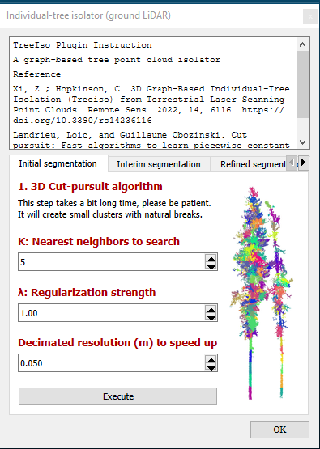

    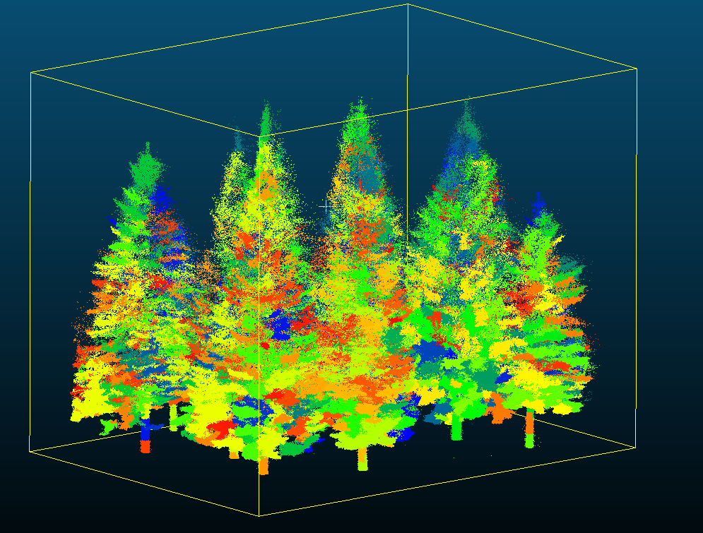

    *   Put in parameters and do the second step - interim segmentation - 2D Cut-pursuit algorithm.

    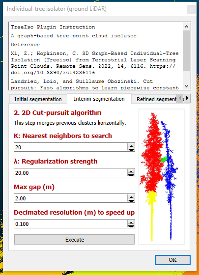

    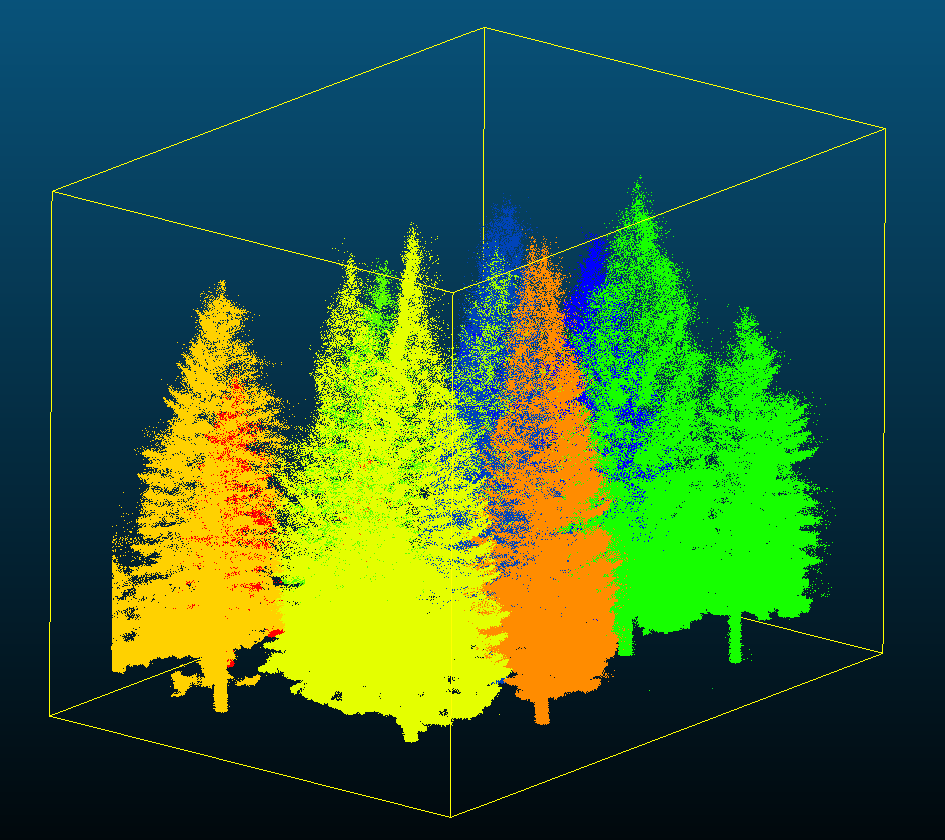

    *   Put in parameters and do the final step - global refinement - final merging based on gaps and overlapping ratio.

    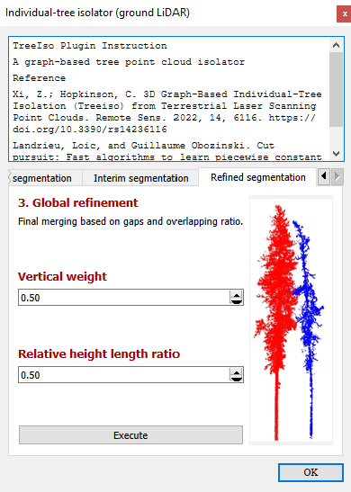

    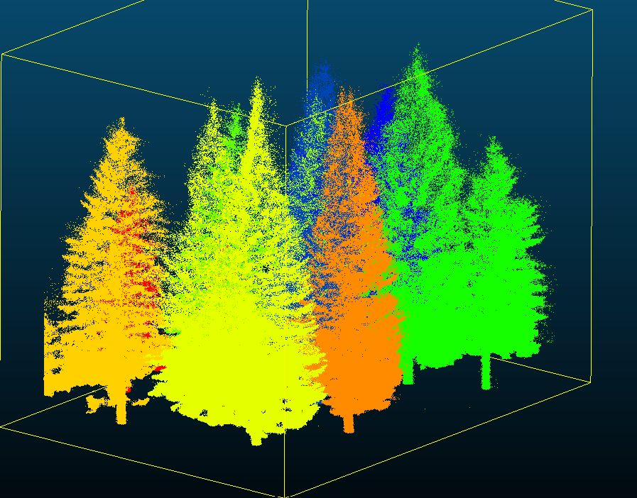

    *   Split the point cloud into individual tree point clouds using **Split cloud** tool.
    
    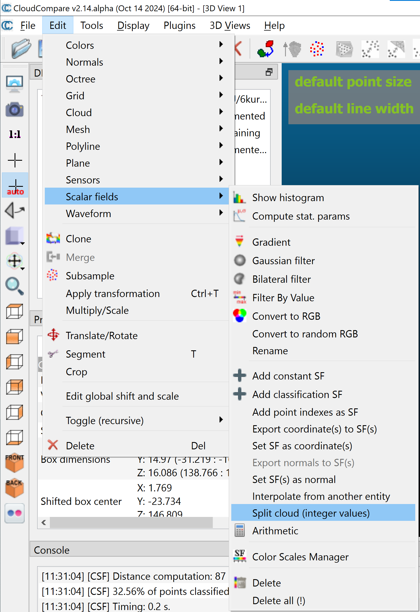 

    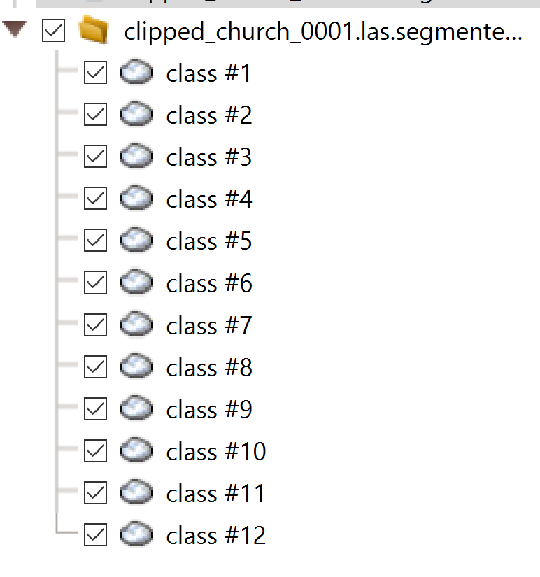

    *   Find 5 best segmented trees, open them and make the screenshots of them. Scalar field should be Coord.Z. Here are the examples of well-segmented trees.

    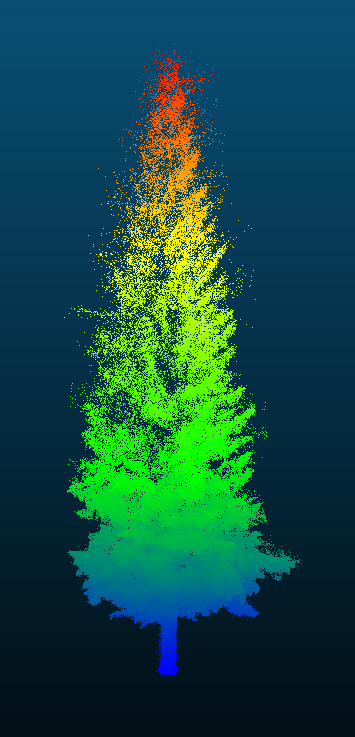 

    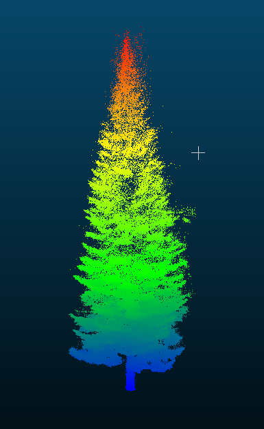
3.  **Export:**
    *   Export the individual tree point clouds to separate .las files.

**Recommendations:**

*   Take your time setting the parameters of CSF and TreeIso plugin.
*   Do not process the entire point cloud on a computer with limited RAM (less than 16 GB). It will definitely take a long time, and CloudCompare is likely to crash.
*   Do not neglect manual editing of individual points if it improves the result, especially when adjusting various plugin parameters does not solve the problem.
*   If you have questions, feel free to ask.

**Expected Result:**

*   You should have 5 individual tree point clouds as .las files and 5 screenshots of these clouds, opened in CloudCompare.
*   You should know how to use CloudCompare tools for tree segmentation.

## Final words

Congratulations on completing this course on point cloud processing with CloudCompare! You’ve gained valuable skills and knowledge to work with 3D point cloud data, from preprocessing and classification to advanced segmentation and analysis using powerful tools like plugins and scalar fields.

Point cloud processing is a vital skill in various fields, including GIS, forestry, urban planning, and architecture, and your ability to navigate and manipulate complex datasets will set you apart as a skilled professional.

As you move forward, remember:

Experimentation is key—explore new tools and techniques to refine your workflows.
Always optimize your processing steps for the hardware you have available.
Don’t shy away from manual interventions when automation doesn’t deliver the desired results.
We hope this course has equipped you with a solid foundation to tackle real-world challenges in 3D data processing. Keep learning, stay curious, and push the boundaries of what you can achieve with CloudCompare. Best of luck in your future projects!

## References

Pereira, Á.; Cabaleiro, M.; Conde, B.; Sánchez-Rodríguez, A. Automatic Identification and Geometrical Modeling of Steel Rivets of Historical Structures from Lidar Data. Remote Sens. 2021, 13, 2108. https://doi.org/10.3390/rs13112108

Radić Rossi, I., Casabán, J., Yamafune, K., Torres, R., Batur, K. (2019). Systematic Photogrammetric Recording of the Gnalić Shipwreck Hull Remains and Artefacts. In: McCarthy, J., Benjamin, J., Winton, T., van Duivenvoorde, W. (eds) 3D Recording and Interpretation for Maritime Archaeology. Coastal Research Library, vol 31. Springer, Cham. https://doi.org/10.1007/978-3-030-03635-5_4

Saura-Gómez, P.; Spairani-Berrio, Y.; Huesca-Tortosa, J.A.; Spairani-Berrio, S.; Rizo-Maestre, C. Advances in the Restoration of Buildings with LIDAR Technology and 3D Reconstruction: Forged and Vaults of the Refectory of Santo Domingo de Orihuela (16th Century). Appl. Sci. 2021, 11, 8541. https://doi.org/10.3390/app11188541

Xi, Z.; Hopkinson, C. 3D Graph-Based Individual-Tree Isolation (Treeiso) from Terrestrial Laser Scanning Point Clouds. Remote Sens. 2022, 14, 6116. https://doi.org/10.3390/rs14236116