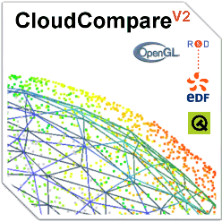

# Course Introduction: Mastering CloudCompare for 3D Point Cloud Analysis

Welcome to **Mastering CloudCompare for 3D Point Cloud Analysis, a comprehensive course designed to help professionals and enthusiasts unlock the full potential of CloudCompare—a powerful open-source software for processing and analyzing 3D point cloud data.
CloudCompare is widely used across diverse industries to manage, visualize, analyze, and edit complex 3D datasets. Whether you’re working with LiDAR scans, photogrammetry outputs, or any other 3D survey data, this course will empower you to leverage CloudCompare effectively for your specific needs.
## Who Is This Course For?
This course is tailored for individuals and professionals who work with 3D point clouds, meshes, and related data, including:
* Geospatial and Surveying Professionals: Process survey-grade point clouds for mapping, monitoring, and planning.  
* Architects, Constructors, and Civil Engineers: Utilize 3D datasets for design, construction, and structural analysis.  
* Archaeologists and Cultural Heritage Experts: Analyze heritage sites and artifacts using high-fidelity 3D models.  
* Scientists: Geologists, geographers, ecologists, and other researchers seeking to extract meaningful insights from spatial data.  
* Anyone Else: Whether you're a student, researcher, or tech enthusiast, if you're working with point clouds and meshes, this course is for you!  
________________________________________
## Course Structure
This course is divided into five engaging and progressively advanced lessons:
1. Introduction to CloudCompare and 3D Point Clouds.
	Overview of 3D point cloud data and its applications.  
	Familiarization with CloudCompare’s interface and features.  
2. Basic Operations with Point Cloud Data.  
	Importing, visualizing, and managing point cloud datasets.  
	Performing essential transformations and measurements.  
3. Filtering and Analysis Techniques.  
	Cleaning and optimizing datasets with filtering tools.  
	Advanced analysis, including distance measurements and volume computations.  
4. Point Classification and Mesh Creation.  
	Classifying and segmenting point clouds for better organization.  
	Generating and refining 3D meshes from point clouds.  
5. Practical Applications.  
	Real-world workflows across various industries.  
	Tips for achieving accurate results and optimizing performance.  
________________________________________
## Learning Outcomes
By the end of this course, you will:
* Gain a solid understanding of 3D point cloud data and how to work with it in CloudCompare.  
* Perform advanced processing and analysis tasks to extract valuable insights.  
* Apply your skills to real-world projects, improving accuracy and efficiency.  
Let’s embark on this journey together to master CloudCompare and transform the way you work with 3D datasets!

